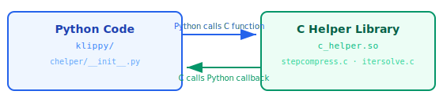
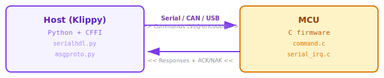
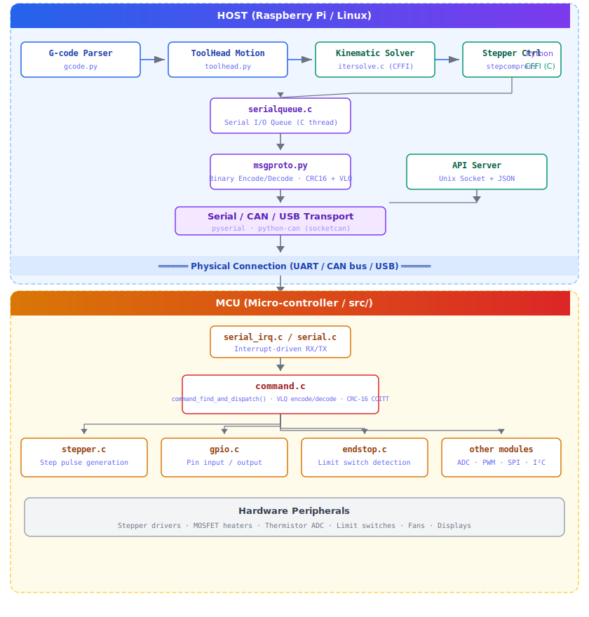

# Communication Protocol: C ↔ Python Interface

This document describes the various communication mechanisms used
between the C/C++ code in the `src/` directory and the Python code
in the `klippy/` directory within Kalico. Understanding these
mechanisms is essential for developers who want to modify or
extend the firmware.

---

## Overview

Kalico employs a multi-layered communication architecture to
bridge the gap between high-level Python host code and low-level
C micro-controller firmware. There are **four distinct
communication channels**:

| Channel | Mechanism | Format | Direction | Use Case |
|---------|-----------|--------|-----------|----------|
| **CFFI** | `cffi` library | C function calls | Python ↔ C | Performance-critical computations |
| **Serial/UART** | `pyserial` / `python-can` | Binary protocol | Host ↔ MCU | MCU command/response |
| **Custom Binary Protocol** | `msgproto.py` ↔ `command.c` | VLQ + CRC16 | Host ↔ MCU | Firmware RPC |
| **API Server** | Unix Domain Socket | JSON + ETX | External ↔ Host | Monitoring/control |

---

## 1. CFFI: Python ↔ C Helper Library

### Location
- Python wrapper: `klippy/chelper/__init__.py`
- C source files: `klippy/chelper/*.c`
- Compiled library: `klippy/chelper/c_helper.so`

### How It Works

The CFFI (C Foreign Function Interface) layer allows Python code
to call C functions directly for performance-critical operations.
On startup, Kalico checks if `c_helper.so` exists and is
up-to-date. If not, it compiles all C helper files using `gcc`
with the following flags:

```
-Wall -g -O2 -shared -fPIC -flto -fwhole-program -fno-use-linker-plugin
```

The C source files are compiled into a single shared library:

| C Source File | Purpose |
|---------------|---------|
| `pyhelper.c` | Python logging callback registration |
| `serialqueue.c` | Low-latency serial I/O queue |
| `stepcompress.c` | Stepper pulse compression |
| `itersolve.c` | Iterative solver for step timing |
| `trapq.c` | Trapezoidal velocity queue |
| `pollreactor.c` | Polling-based event reactor |
| `msgblock.c` | Message block framing |
| `trdispatch.c` | Trigger dispatch |
| `kin_cartesian.c` | Cartesian kinematics |
| `kin_corexy.c` | CoreXY kinematics |
| `kin_corexz.c` | CoreXZ kinematics |
| `kin_delta.c` | Delta kinematics |
| `kin_deltesian.c` | Deltesian kinematics |
| `kin_polar.c` | Polar kinematics |
| `kin_rotary_delta.c` | Rotary delta kinematics |
| `kin_winch.c` | Winch kinematics |
| `kin_extruder.c` | Extruder pressure advance |
| `kin_shaper.c` | Input shaper |
| `kin_idex.c` | Dual carriage (IDEX) |

### CFFI Function Definition Example

In `chelper/__init__.py`, function signatures are declared as C
strings:

```python
defs_stepcompress = """
    struct stepcompress *stepcompress_alloc(uint32_t oid);
    void stepcompress_fill(struct stepcompress *sc, uint32_t max_error
        , int32_t queue_step_msgtag, int32_t set_next_step_dir_msgtag);
    void stepcompress_free(struct stepcompress *sc);
    // ...
"""
```

These definitions are loaded with:

```python
import cffi
FFI_main = cffi.FFI()
FFI_main.cdef(defs_stepcompress)
FFI_lib = FFI_main.dlopen("c_helper.so")
```

### Usage in Python Code

Python modules import and use the C helpers like this:

```python
from . import chelper
ffi_main, ffi_lib = chelper.get_ffi()

# Call C functions directly
self._stepqueue = ffi_main.gc(
    ffi_lib.stepcompress_alloc(oid),
    ffi_lib.stepcompress_free
)
```

### Python Callbacks into C

C code can also call Python functions via CFFI callbacks.
For example, logging from C to Python:

```python
# In chelper/__init__.py
@FFI_main.callback("void func(const char *)")
def logging_callback(msg):
    logging.info("MCU: %s", ffi_main.string(msg).decode())

pyhelper_logging_callback = FFI_main.callback(
    "void func(const char *)", logging_callback
)
FFI_lib.set_python_logging_callback(pyhelper_logging_callback)
```

### Data Flow: CFFI



---

## 2. Serial / UART Communication

### Location
- Python: `klippy/serialhdl.py`
- C low-level: `src/generic/serial_irq.c`
- Platform-specific: `src/*/serial.c`

### How It Works

The host computer (e.g., Raspberry Pi) communicates with the
micro-controller via a serial connection. This can be:

- **UART (TTL Serial)**: Direct GPIO-based serial
- **USB CDC ACM**: Virtual serial port over USB
- **CAN Bus**: Controller Area Network using `python-can`

### Connection Establishment

```python
# In serialhdl.py
import serial
self.serial = serial.Serial(port, baudrate)
```

For CAN bus:

```python
import can
self.can = can.interface.Bus(channel='can0', bustype='socketcan')
```

### C-side Serial Handling

On the micro-controller, serial data reception is interrupt-driven:

```c
// In src/generic/serial_irq.c
void serial_enable_receive(int fd) {
    // Enable UART RX interrupt
}
```

Received bytes are accumulated and passed to `command_find_and_dispatch()`
which locates complete message blocks and dispatches commands.

### Data Flow: Serial



---

## 3. Binary Message Protocol (The Core RPC Layer)

This is the **most important** communication mechanism between the
host and the micro-controller. It is a custom binary protocol
that works like a Remote Procedure Call (RPC) system.

### Location
- Python encoder/decoder: `klippy/msgproto.py`
- C encoder/decoder/dispatcher: `src/command.c` + `src/command.h`

### Message Block Format

Every message transmitted between host and MCU is wrapped in a
message block with the following structure:

```
Offset  Size  Field
─────────────────────────
 0       1    Length (total block size, min=5, max=64)
 1       1    Sequence (4-bit seq | 0x10)
 2       n    Content (VLQ-encoded commands/responses)
 2+n     2    CRC-16 CCITT
 2+n+2   1    Sync byte (0x7E)
```

**Key Constants** (identical in both `msgproto.py` and `command.h`):

| Constant | Value | Description |
|----------|-------|-------------|
| `MESSAGE_MIN` | 5 | Minimum message block size |
| `MESSAGE_MAX` | 64 | Maximum message block size |
| `MESSAGE_HEADER_SIZE` | 2 | Header bytes (len + seq) |
| `MESSAGE_TRAILER_SIZE` | 3 | Trailer bytes (crc16[2] + sync) |
| `MESSAGE_SYNC` | 0x7E | Frame sync marker |
| `MESSAGE_DEST` | 0x10 | Sequence byte high bits |

### Variable Length Quantity (VLQ) Encoding

Integers in the message content are encoded using a custom VLQ
scheme that supports both positive and negative values:

| Integer Range | Encoded Bytes |
|---------------|---------------|
| -32 .. 95 | 1 byte |
| -4096 .. 12287 | 2 bytes |
| -524288 .. 1572863 | 3 bytes |
| -67108864 .. 201326591 | 4 bytes |
| -2147483648 .. 4294967295 | 5 bytes |

**Encoding Rules**:
- Each byte uses 7 bits for data, 1 bit (MSB) as continuation flag
- Sign extension is handled at decode time
- Smaller absolute values use fewer bytes

**C Implementation** (`src/command.c`):
```c
static uint8_t *encode_int(uint8_t *p, uint32_t v) {
    int32_t sv = v;
    if (sv < (3L<<5)  && sv >= -(1L<<5))  goto f4;  // 1 byte
    if (sv < (3L<<12) && sv >= -(1L<<12)) goto f3;  // 2 bytes
    if (sv < (3L<<19) && sv >= -(1L<<19)) goto f2;  // 3 bytes
    if (sv < (3L<<26) && sv >= -(1L<<26)) goto f1;  // 4 bytes
    *p++ = (v>>28) | 0x80;                           // 5 bytes
f1: *p++ = ((v>>21) & 0x7f) | 0x80;
f2: *p++ = ((v>>14) & 0x7f) | 0x80;
f3: *p++ = ((v>>7) & 0x7f) | 0x80;
f4: *p++ = v & 0x7f;
    return p;
}
```

**Python Implementation** (`klippy/msgproto.py`):
```python
class PT_uint32:
    def encode(self, out, v):
        if v >= 0xC000000 or v < -0x4000000:
            out.append((v >> 28) & 0x7F | 0x80)
        if v >= 0x180000 or v < -0x80000:
            out.append((v >> 21) & 0x7F | 0x80)
        if v >= 0x3000 or v < -0x1000:
            out.append((v >> 14) & 0x7F | 0x80)
        if v >= 0x60 or v < -0x20:
            out.append((v >> 7) & 0x7F | 0x80)
        out.append(v & 0x7F)
```

### Parameter Types

The protocol supports these parameter types:

| Type Name | C Enum | Python Class | Description |
|-----------|--------|--------------|-------------|
| `%u` | `PT_uint32` | `PT_uint32` | Unsigned 32-bit integer |
| `%i` | `PT_int32` | `PT_int32` | Signed 32-bit integer |
| `%hu` | `PT_uint16` | `PT_uint16` | Unsigned 16-bit integer |
| `%hi` | `PT_int16` | `PT_int16` | Signed 16-bit integer |
| `%c` | `PT_byte` | `PT_byte` | 8-bit byte |
| `%s` | `PT_string` | `PT_string` | Dynamic string |
| `%.*s` | `PT_progmem_buffer` | `PT_progmem_buffer` | Flash-stored buffer |
| `%*s` | `PT_buffer` | `PT_buffer` | RAM buffer |

### Command Declaration (C side)

Commands are declared in C using `DECL_COMMAND()`:

```c
DECL_COMMAND(command_update_digital_out,
             "update_digital_out oid=%c value=%c");
```

This generates a `command_parser` structure in the compiled binary:

```c
struct command_parser {
    uint16_t encoded_msgid;   // VLQ-encoded message ID
    uint8_t num_args;         // Number of function arguments
    uint8_t flags;            // Handler flags (e.g., HF_IN_SHUTDOWN)
    uint8_t num_params;       // Number of wire-format parameters
    const uint8_t *param_types; // Array of parameter type enums
    void (*func)(uint32_t *args); // Handler function pointer
};
```

### Response Transmission (C side)

Responses are sent using the `sendf()` macro:

```c
sendf("status clock=%u status=%c",
      sched_read_time(), sched_is_shutdown());
```

### Message Content: Multiple Commands Per Block

A single message block can contain multiple commands:

```
Human Readable:
  update_digital_out oid=6 value=1
  update_digital_out oid=5 value=0
  get_config
  get_clock

Binary (VLQ integers):
  <id_update_digital_out><6><1><id_update_digital_out><5><0><id_get_config><id_get_clock>
```

### CRC-16 CCITT

Both sides use identical CRC-16 CCITT implementations for data
integrity verification:

```python
# Python (msgproto.py)
def crc16_ccitt(buf):
    crc = 0xFFFF
    for data in buf:
        data ^= crc & 0xFF
        data ^= (data & 0x0F) << 4
        crc = ((data << 8) | (crc >> 8)) ^ (data >> 4) ^ (data << 3)
    return [crc >> 8, crc & 0xFF]
```

The C implementation is in board-specific code (e.g.,
`src/generic/crc16_ccitt.c`).

### Data Dictionary (Identify Protocol)

When the host first connects to an MCU, it must download the
**data dictionary**. This dictionary maps command/response format
strings to their numeric IDs.

1. Host sends `identify` commands requesting chunks of data
2. MCU responds with `identify_response` containing compressed JSON
3. JSON is zlib-compressed and stored in the MCU's flash
4. Once assembled, the host parses the JSON to learn all available
   commands, responses, enumerations, and constants

The `identify` command (ID=1) and `identify_response` (ID=0) are
the only messages with hard-coded IDs. Everything else is dynamic.

### Acknowledgement and Retransmission

**Host → MCU** (Assured delivery):
- Each correctly received block triggers an ACK from the MCU
- Host retransmits on timeout
- MCU sends NAK for corrupt/out-of-order blocks
- Windowing allows multiple in-flight blocks

**MCU → Host** (Best-effort):
- No automatic retransmission
- High-level code must handle missing responses
- Sequence numbers track host-originated traffic only

---

## 4. API Server: Unix Domain Socket + JSON

### Location
- Python: `klippy/webhooks.py`

### How It Works

The API Server provides external access to printer status and
controls via a Unix Domain Socket:

```python
# In webhooks.py
self.sock = socket.socket(socket.AF_UNIX, socket.SOCK_STREAM)
self.sock.bind("/tmp/kalico_uds")
```

### Message Format

Messages are JSON-encoded strings terminated by `0x03` (ETX):

```
<json_object_1><0x03><json_object_2><0x03>...
```

This allows tools like OctoPrint, Mainsail, and Fluidd to
communicate with Kalico for monitoring and control.

---

## 5. Thread Architecture

The host-side Klippy process uses **4 threads**:

| Thread | Location | Purpose |
|--------|----------|---------|
| Main | `klippy/gcode.py` | Incoming G-code processing |
| Serial I/O | `klippy/chelper/serialqueue.c` | Low-level serial port I/O |
| Response Handler | `klippy/serialhdl.py` | Process MCU response messages |
| Logger | `klippy/queuelogger.py` | Non-blocking debug logging |

---

## 6. Complete Data Flow Diagram



---

## 7. Summary

| Layer | Python Side | C Side | Format | Reliability |
|-------|-------------|--------|--------|-------------|
| **CFFI** | `chelper/__init__.py` | `chelper/*.c` | Direct function calls | N/A (in-process) |
| **Binary Protocol** | `msgproto.py` | `command.c/h` | VLQ integers + CRC16 | ACK/retransmit |
| **Serial Transport** | `serialhdl.py` | `serial_irq.c` | Raw bytes over UART/CAN/USB | Hardware dependent |
| **API Server** | `webhooks.py` | N/A | JSON + ETX over Unix socket | TCP reliability |
| **Data Dictionary** | `msgproto.py` (parse) | `compile_time_request.c` (generate) | Zlib-compressed JSON | Identified at connect |

### Key Design Principles

1. **Minimal MCU complexity**: The MCU uses a static (compile-time)
   data dictionary. The host adapts to whatever the MCU provides.
2. **Bandwidth efficiency**: VLQ encoding minimizes bytes for
   common small values. Multiple commands are batched per block.
3. **Error detection**: CRC-16 CCITT catches corruption. Sequence
   numbers detect out-of-order delivery.
4. **Separation of concerns**: CFFI handles computation, serial
   handles transport, msgproto handles encoding, and the API
   server handles external access.
5. **Performance-critical paths in C**: Step compression, iterative
   solving, and serial I/O are all implemented in C for speed,
   while high-level logic remains in Python for flexibility.

---

## See Also

- [Protocol](Protocol.md) — Details of the host↔MCU binary protocol
- [Code Overview](Code_Overview.md) — Overall code structure
- [MCU Commands](MCU_Commands.md) — Available MCU commands
- [Debugging](Debugging.md) — How to inspect protocol messages
