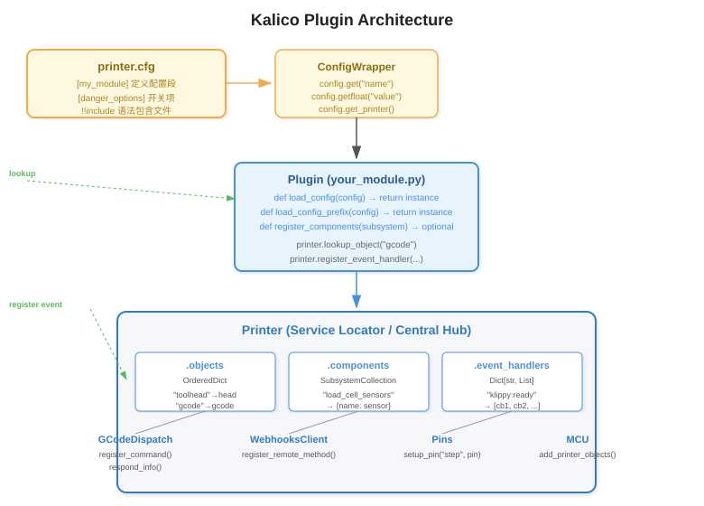
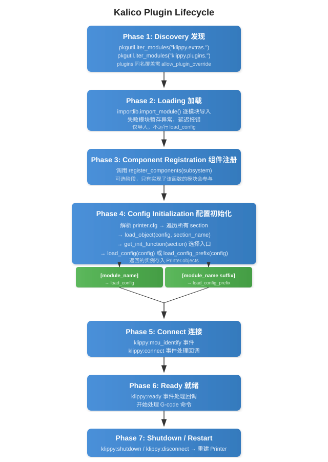

# Plugin Development Guide

This document describes how to develop, install, and manage plugins for Kalico.
Plugins allow you to extend Kalico's functionality without modifying the core
source tree, ensuring your customizations survive updates.

## Table of Contents

- [Overview](#overview)
- [Quick Start](#quick-start)
- [Plugin Directory Structure](#plugin-directory-structure)
- [Architecture](#architecture)
- [Lifecycle](#lifecycle)
- [Plugin API Reference](#plugin-api-reference)
- [Subsystem Component Registration](#subsystem-component-registration)
- [Service Locator Pattern](#service-locator-pattern)
- [Lifecycle Events](#lifecycle-events)
- [G-code Command Registration](#g-code-command-registration)
- [Webhooks / Remote API](#webhooks--remote-api)
- [Configuration](#configuration)
- [Best Practices](#best-practices)
- [Debugging & Introspection](#debugging--introspection)
- [Migrating from `extras/` to `plugins/`](#migrating-from-extras-to-plugins)
- [Using the Plugin Installer](#using-the-plugin-installer)
- [Complete Example](#complete-example)
- [Troubleshooting](#troubleshooting)

---

## Overview

Kalico's plugin system follows a **convention-over-configuration** design.
Instead of XML manifests, JSON metadata, or plugin registries, a plugin is simply
a Python module (a `.py` file or a sub-package) placed in `klippy/plugins/`.
The presence of the file is its registration.

**Core concepts:**

| Concept | Description |
|---------|-------------|
| **extras** | Built-in modules shipped with Kalico, located in `klippy/extras/` |
| **plugins** | User/external modules, located in `klippy/plugins/` (git-untracked) |
| **PrinterModule** | Wrapper around a discovered module; handles lazy loading, error tracking |
| **Config section** | A `[name]` or `[name suffix]` entry in `printer.cfg` that triggers your module's instantiation |
| **Printer.objects** | The central OrderedDict where all instantiated module instances live |

### Key Design Decisions

- **No enable/disable list.** A plugin is loaded only if a corresponding
  `[section]` appears in `printer.cfg`. Without it, the module is imported
  but never instantiated (marked as "unused" in `LIST_MODULES`).
- **The `plugins/` directory is git-untracked.** It does not exist in the
  upstream Kalico tree. Drop files here freely — no dirty git tree.
- **Plugin overrides are gated.** If a plugin has the same name as a built-in
  extra, Kalico raises an error unless `allow_plugin_override: True` is set
  in `[danger_options]`. This prevents accidental shadowing.

---

## Quick Start

Create the file `klippy/plugins/my_tool.py`:

```python
class MyTool:
    def __init__(self, config):
        self.printer = config.get_printer()
        self.name = config.get_name()
        gcode = self.printer.lookup_object("gcode")
        gcode.register_command("MY_COMMAND", self.cmd_MY_COMMAND)
        self.printer.register_event_handler("klippy:ready", self._on_ready)

    def _on_ready(self):
        pass  # Initialization that requires a connected printer

    def cmd_MY_COMMAND(self, gcmd):
        gcmd.respond_info("Hello from my_tool!")

def load_config(config):
    return MyTool(config)
```

Add to `printer.cfg`:

```ini
[my_tool]
```

Restart Kalico. Run `MY_COMMAND` from the console — you should see "Hello from my_tool!".

---

## Plugin Directory Structure

```
klippy/
├── extras/                  # Built-in modules (part of Kalico core)
│   ├── __init__.py
│   ├── respond.py
│   └── ...
├── plugins/                 # User plugins (git-untracked)
│   ├── __init__.py          # Package marker (always present)
│   ├── my_tool.py           # Single-file plugin
│   ├── my_complex_plugin/   # Sub-package plugin
│   │   ├── __init__.py      # Contains load_config / load_config_prefix
│   │   ├── helpers.py
│   │   └── sensor.py
│   └── ...
```

### Single-file vs Sub-package

| Style | When to use | Example |
|-------|-------------|---------|
| **Single `.py` file** | Simple plugin, no helper files | `my_tool.py` |
| **Sub-package with `__init__.py`** | Plugin with multiple modules, helpers, or data files | `my_complex_plugin/` |

Both styles are auto-discovered. The module name is the filename (without `.py`)
or the directory name.

### Import Rules

Your plugin lives inside the `klippy.plugins` package. When you need to import
from built-in extras, use the full `klippy.extras.*` path:

```python
from klippy.extras.gcode_macro import Template  # correct
from klippy.extras.servo import Servo            # correct
```

Relative imports within your own sub-package work as usual:

```python
from .helpers import my_helper                   # within your sub-package
```

---

## Architecture

The following diagram shows how the key components interact:



- **printer.cfg** provides `[section]` definitions and option values.
- **ConfigWrapper** wraps each section, providing typed access (`get()`, `getfloat()`, `getint()`, etc.).
- Your **Plugin** implements `load_config(config)` or `load_config_prefix(config)`, receiving a `ConfigWrapper`.
- The **Printer** acts as the **Service Locator** — your plugin pulls dependencies by name:
  - `printer.lookup_object("gcode")` — get a registered service
  - `printer.load_object(config, "heaters")` — lazily load another module
  - `printer.register_event_handler("klippy:ready", cb)` — subscribe to events
  - `printer.lookup_components("load_cell_sensors")` — query a subsystem registry

---

## Lifecycle



### Phase Details

**Phase 1 – Discovery** (`printer.py:_load_modules`)
All `*.py` files in `klippy/extras/` and `klippy/plugins/` are discovered via
`pkgutil.iter_modules()`. Each becomes a `PrinterModule` stored in
`printer.printer_modules`. If a plugin has the same name as an existing extra,
Kalico raises an error unless `allow_plugin_override: True` is set.

**Phase 2 – Loading** (`printer.py:_load_modules`)
Each `PrinterModule.load()` calls `importlib.import_module(module_info.name)`.
Exceptions during import are caught and stored — the error is raised later,
only if the module is actually used. This means a broken plugin that is never
referenced in `printer.cfg` will not crash the startup.

**Phase 3 – Component Registration** (`printer.py:_register_subsystem_components`)
If a module defines `register_components(subsystem)`, it is called to populate
named subsystem registries. This is optional and used by plugins that provide
driver-like components (e.g., sensor types for the load cell subsystem).

**Phase 4 – Config Initialization** (`printer.py:_read_config`)
For every `[section]` in `printer.cfg`, `printer.load_object(config, section)`
finds the matching `PrinterModule` and calls its `load_config(config)` or
`load_config_prefix(config)`. The returned instance is stored in `printer.objects`.
The config section must read ALL its parameters during this phase; unread
parameters are flagged as errors.

**Phase 5 – Connect** (`printer.py:_connect`)
The `"klippy:connect"` event fires after all modules are instantiated.
Use this phase for inter-module lookups, config validation, and hardware handshakes.

**Phase 6 – Ready** (`printer.py:_connect`)
The `"klippy:ready"` event fires after all connect handlers finish.
The printer is now ready to process G-code commands. Do not raise errors here.

**Phase 7 – Shutdown / Restart** (`printer.py:run`)
On `RESTART` or `FIRMWARE_RESTART`, the `Printer` and `Reactor` are destroyed
and recreated from scratch. All modules are re-imported and re-initialized.
There is no hot-plug mechanism — a restart is required.

---

## Plugin API Reference

Every plugin module must expose at least one of the following module-level
functions:

### `load_config(config)` → object

```python
def load_config(config):
    return MyPlugin(config)
```

Called when `printer.cfg` contains `[my_plugin]` (exact match, no suffix).
Receives a `ConfigWrapper` for that section. Must return the constructed object.

### `load_config_prefix(config)` → object

```python
def load_config_prefix(config):
    return MyPlugin(config)
```

Called for sections like `[my_plugin instance1]`, `[my_plugin instance2]`, etc.
(prefixed match, with a space separating the module name and suffix).
Enables multiple instances of the same module.

### `register_components(subsystem)` (optional)

```python
def register_components(subsystem):
    subsystem.register_component("my_subsystem", "my_component", MyDriver)
```

Called during startup to register named components into a subsystem registry.
See [Subsystem Component Registration](#subsystem-component-registration) for details.

### `ConfigWrapper` API

```python
value = config.get("option_name", default=None)
flag  = config.getboolean("bool_option", False)
num   = config.getfloat("float_option", 1.0, minval=0.0, maxval=10.0)
count = config.getint("int_option", 5, minval=0)
choice = config.getchoice("mode", {"fast": 1, "slow": 2}, "fast")
name  = config.get_name()         # Full section name, e.g. "my_plugin instance1"
printer = config.get_printer()    # The Printer service locator
section = config.getsection("subsection")  # Get nested section
```

---

## Subsystem Component Registration

Some plugins are not "standalone modules" but instead provide components
to a larger subsystem. For example, each ADC sensor driver registers itself
into the `"load_cell_sensors"` subsystem, and the main `[load_cell]` config
section uses `config.getchoice("sensor_type", sensors)` to let the user choose.

### Provider Side (registering into a subsystem)

```python
# In your plugin's register_components():
def register_components(subsystem):
    subsystem.register_component(
        "my_subsystem",           # subsystem name (string key)
        "my_driver_v1",           # component name (shown to user in config)
        MyDriverClass             # the component (class, function, or value)
    )
```

See `klippy/extras/load_cell/__init__.py:14` for a real example.

### Consumer Side (looking up from a subsystem)

```python
sensors = printer.lookup_components("my_subsystem")  # → {"my_driver_v1": MyDriverClass, ...}
chosen = config.getchoice("driver_type", sensors)    # user picks from choices
instance = chosen(config)                             # instantiate the chosen one
```

---

## Service Locator Pattern

Kalico uses a **Service Locator** (pull-based) pattern rather than Dependency
Injection (push-based). Your plugin is responsible for pulling its dependencies
from the `Printer` instance.

### Key Methods on `Printer`

```python
# Get a reference to the Printer instance
printer = config.get_printer()

# Look up a previously registered object by its config section name
gcode = printer.lookup_object("gcode")
toolhead = printer.lookup_object("toolhead")

# Lazily load another module (returns cached instance on subsequent calls)
heaters = printer.load_object(config, "heaters")

# Query a subsystem component registry
components = printer.lookup_components("load_cell_sensors")

# Get the reactor (for timers, file I/O, sleep)
reactor = printer.get_reactor()

# Get startup arguments
args = printer.get_start_args()

# Check if printer is in shutdown state
if printer.is_shutdown():
    return
```

### Why Pull-based?

- The initialization order is non-trivial — not all modules exist when your
  plugin is constructed. Defer lookups to event handlers (e.g., `"klippy:connect"`)
  to avoid missing dependencies.
- The `gcode` and `pins` objects are always available early.
- Use `printer.load_object(config, "module_name")` to force-load a dependency.

---

## Lifecycle Events

Register event handlers to hook into Kalico's lifecycle:

```python
printer.register_event_handler("event_name", callback_function)
```

### Standard Events

| Event | Stage | Common Use |
|-------|-------|------------|
| `"klippy:connect"` | After all modules instantiated | Cross-module lookups, config validation, hardware check |
| `"klippy:ready"` | Printer fully operational | Begin auto-routines, enable features |
| `"klippy:disconnect"` | During restart/shutdown | Close files, sockets, cleanup resources |
| `"klippy:shutdown"` | Error/fault shutdown | Safely stop hardware, log state |
| `"klippy:firmware_restart"` | Before firmware restart | Save state before MCU reset |
| `"klippy:mcu_identify"` | MCU identification phase | Register MCU-dependent objects |
| `"gcode:command_error"` | G-code parsing error | Custom error recovery |
| `"gcode:unknown_command"` | Unrecognized G-code | Implement custom command resolution |

### Event Handler Guidelines

```python
def _handle_connect(self):
    # SAFE: look up other objects
    self.toolhead = self.printer.lookup_object("toolhead")

def _handle_ready(self):
    # SAFE: start operations, send commands
    # Do NOT raise errors here

def _handle_shutdown(self):
    try:
        self.motor.stop()
    except:
        pass  # Suppress errors during shutdown
```

---

## G-code Command Registration

Register custom G-code commands in your module's `__init__`:

```python
class MyPlugin:
    def __init__(self, config):
        self.gcode = self.printer.lookup_object("gcode")
        self.gcode.register_command("MY_CMD", self.cmd_MY_CMD, "Description for help")

    def cmd_MY_CMD(self, gcmd):
        # Read parameters
        speed = gcmd.get_float("S", 0.0)
        value = gcmd.get("PARAM", "default")

        # Respond to the console
        gcmd.respond_info(f"Got S={speed}, PARAM={value}")

        # Raise errors on invalid input
        if speed < 0:
            raise gcmd.error("Speed must be positive")
```

### `gcmd` Object API

```python
gcmd.get("NAME", default=None)           # String parameter
gcmd.get_float("S", default=0., minval=0)  # Float parameter
gcmd.get_int("N", default=0, minval=0)   # Integer parameter
gcmd.respond_info("message")             # Standard response
gcmd.respond_raw("raw text")             # Raw output
gcmd.error("error message")              # Raise an error (aborts command)
```

---

## Webhooks / Remote API

Expose JSON-RPC endpoints for external clients (Mainsail, Fluidd, etc.):

```python
class MyPlugin:
    def __init__(self, config):
        webhooks = self.printer.lookup_object("webhooks")
        webhooks.register_endpoint("my_plugin/get_status", self._handle_api)

    def _handle_api(self, web_request):
        return {
            "temperature": 42.0,
            "status": "ok",
        }
```

### `get_status()` for Automatic Status Exposure

Define `get_status()` on your printer object to automatically expose its
state via the API server and Jinja templates:

```python
class MyPlugin:
    def get_status(self):
        return {
            "value": self.current_value,
            "active": self.is_active,
        }
```

Status values must be: `int`, `float`, `str`, `bool`, `list`, `dict`, `tuple`,
or `None`. Lists and dicts must be treated as immutable — return a new object
if contents change.

---

## Configuration

### Basic Section

```ini
[my_tool]
option1: some_value
option2: 3.14
option3: True
```

### Multiple Instances via `load_config_prefix`

```ini
[my_tool extruder]
name: hotend_left
max_temp: 300

[my_tool bed]
name: heated_bed
max_temp: 120
```

Your `load_config_prefix()` receives a separate `ConfigWrapper` for each instance.

### Plugin Override

If your plugin shares a name with a built-in extra (e.g., you create
`klippy/plugins/respond.py`), you must enable overrides:

```ini
[danger_options]
allow_plugin_override: True
```

Without this, Kalico raises an error: `"Module 'respond' found in both extras and plugins!"`.

### Include Other Config Files

Use `!!include` in your plugin's config to pull in larger configurations:

```ini
[my_tool]
!!include path/to/my_tool_defaults.cfg
custom_option: my_value
```

---

## Best Practices

1. **No global variables.** Store all state in your printer object instance.
   `RESTART` recreates the `Printer`, and globals will leak state.

2. **Assign all member variables in `__init__`.** Avoid dynamically creating
   attributes — use `self.xyz = None` in the constructor.

3. **Use floating-point constants for floats.** Prefer `self.speed = 1.` over
   `self.speed = 1`, and `self.speed = 2. * x` over `self.speed = 2 * x`.
   This avoids subtle Python type conversion bugs.

4. **Read all config options during construction.** Parameters not read during
   `__init__` are flagged as typos and cause config errors.

5. **Don't access `_`-prefixed members of other modules.** These are private
   implementation details that may change without notice.

6. **Defer heavy work to event handlers.** Use `"klippy:connect"` for lookups
   of modules that may not exist yet, and `"klippy:ready"` for operations
   that need a fully initialized printer.

7. **Close files/sockets on disconnect.** Register for `"klippy:disconnect"`:

   ```python
   self.printer.register_event_handler("klippy:disconnect", self._cleanup)
   ```

8. **Suppress errors in shutdown handlers.** During emergency shutdown, logging
   an error and swallowing the exception is preferable to blocking the shutdown
   sequence.

---

## Debugging & Introspection

### `LIST_MODULES` Command

Check the status of all loaded modules:

```
LIST_MODULES DETAIL=1
```

Output example:
```
Loaded modules:

  my_tool (plugins, loaded)
    Path: klippy/plugins/my_tool.py
    Loaded: 2025-05-14 12:00:00
    Used: yes
```

Fields explained:
- **source**: `"plugins"` or `"extras"` — where the module came from
- **loaded**: Whether the module was imported successfully (any import errors
  are reported here)
- **used**: Whether any `printer.cfg` section references this module
- **error**: Exception details if loading failed (only shown if `loaded: False`)

### Logging

```python
import logging

logging.info("Informational message")
logging.warning("Warning message")
logging.exception("Exception traceback")  # In except blocks
```

Log output goes to Kalico's `klippy.log` (or stderr if no log file is configured).

### Testing

Use the reference test plugin at `test/klippy_testing_plugin.py` as a template.
Run tests with `scripts/test_klippy.py`.

---

## Migrating from `extras/` to `plugins/`

If you have an existing module in `klippy/extras/` that you want to move to
`klippy/plugins/` to keep your Kalico tree clean:

### Automatic Migration

Use the plugin installer with a local path:

```
python scripts/install_plugin.py /path/to/your/local/plugin --name my_plugin
```

See [Using the Plugin Installer](#using-the-plugin-installer) for details.

### Manual Migration Steps

1. **Move the file.** Copy `klippy/extras/my_module.py` → `klippy/plugins/my_module.py`.

2. **Check imports.** If your module imports from `klippy.extras.*`, those
   imports are already fully qualified and **do not need to change**. Both
   `extras/` and `plugins/` modules live under the `klippy` package.

3. **Remove from extras.** Delete the original from `klippy/extras/`.

4. **Add config section.** Ensure your `printer.cfg` has `[my_module]`.

5. **Enable override (if applicable).** If you're replacing a built-in module
   of the same name, add `allow_plugin_override: True` in `[danger_options]`.

6. **Restart Kalico.** Run `RESTART` or restart the Kalico service.

### When to Use `allow_plugin_override`

Only when your plugin name **matches** an existing extra module name. For unique
plugin names, no override flag is needed.

---

## Using the Plugin Installer

Kalico ships with `scripts/install_plugin.py`, a tool that automates fetching,
analyzing, and installing plugins from a git repository.

### Basic Usage

```bash
python scripts/install_plugin.py <url> [options]
```

| Option | Description |
|--------|-------------|
| `--branch <name>` | Clone a specific git branch (default: default branch) |
| `--name <name>` | Force the installed module name (default: inferred from repo) |
| `--force` | Overwrite existing plugin of the same name |
| `--dry-run` | Analyze and report without installing |

### What It Does

1. Clones the git repository to a temporary directory.
2. Scans for plugin files — any `.py` file containing `load_config` or
   `load_config_prefix`.
3. Detects the correct installation layout (single-file vs sub-package).
4. Uses AST analysis to discover:
   - **G-code commands**: any calls to `gcode.register_command("CMD", ...)`
   - **Dependencies**: any calls to `printer.lookup_object("name")` or
     `printer.load_object(config, "name")`
5. Copies the plugin into `klippy/plugins/<module_name>/`.
6. Prints a friendly installation summary.

### Example Output

```
Fetching plugin from https://github.com/user/kalico-my-cool-sensor...

[1/4] Cloning repository... done.
[2/4] Scanning for plugin modules...
       Found: my_cool_sensor.py (entry: load_config)
[3/4] Analyzing plugin...
       G-code commands detected: COOL_CALIBRATE, COOL_REPORT
       Dependencies detected: gcode, heaters, toolhead
[4/4] Installing to klippy/plugins/...
       klippy/plugins/my_cool_sensor.py installed.

========================================
 Plugin installed: my_cool_sensor
========================================

  Source:        https://github.com/user/kalico-my-cool-sensor
  Install path:  klippy/plugins/my_cool_sensor.py
  Entry point:   load_config(config)

  Available G-code commands:
    COOL_CALIBRATE    → calibrate the cool sensor
    COOL_REPORT       → report current readings

  Required config section (add to printer.cfg):
    [my_cool_sensor]
    sensor_pin: PA0
    # see the plugin's README for full options

  Dependencies (ensure these exist in your config):
    gcode
    heaters
    toolhead

  To activate: send RESTART to Kalico
========================================
```

### Installing from a Local Directory

You can also point the installer at a local path to migrate a plugin from `extras/`:

```bash
python scripts/install_plugin.py ./klippy/extras/my_module.py --name my_module
```

### Installing from a GitHub Repository

```bash
# Default branch
python scripts/install_plugin.py https://github.com/user/kalico-my-plugin

# Specific branch or tag
python scripts/install_plugin.py https://github.com/user/kalico-my-plugin --branch v1.2.0
```

---

## Complete Example

Below is a complete plugin example based on `test/klippy_testing_plugin.py`.
It registers a custom G-code command `ASSERT` that evaluates a Jinja2 expression.

```python
# klippy/plugins/assert_plugin.py
#
# Evaluate an expression and raise an error if False.
# Usage: ASSERT TEST="{1 + 1 == 2}"

import ast
from klippy.extras.gcode_macro import Template


class AssertPlugin:
    def __init__(self, config):
        self.printer = config.get_printer()
        gcode = self.printer.lookup_object("gcode")
        self.gcode_macro = self.printer.load_object(config, "gcode_macro")

        self.printer.register_event_handler(
            "gcode:command_error", self._on_command_error
        )
        self.printer.register_event_handler(
            "gcode:unknown_command", self._on_unknown_command
        )
        gcode.register_command("ASSERT", self.cmd_ASSERT)

    def _on_command_error(self):
        self.printer.request_exit("error_exit")
        self.printer.invoke_shutdown("Exception during testing")

    def _on_unknown_command(self, cmd):
        self.printer.request_exit("error_exit")
        self.printer.invoke_shutdown(
            f"Unknown command during test: {cmd}"
        )

    def cmd_ASSERT(self, gcmd):
        expression = gcmd.get("TEST")
        try:
            template = Template(
                self.printer,
                self.gcode_macro.env,
                "ASSERT:runtime_expression",
                expression,
            )
        except Exception:
            raise gcmd.error(f"ASSERT: Failed to parse '{expression}'")

        context = self.gcode_macro.create_template_context()
        result = template.render(context)
        value = ast.literal_eval(result) if result else None

        if not value:
            raise gcmd.error(f"ASSERT: {expression} == {value}")


def load_config(config):
    return AssertPlugin(config)
```

Configuration in `printer.cfg`:

```ini
[assert_plugin]
```

---

## Troubleshooting

### "Module 'xxx' found in both extras and plugins!"

Your plugin has the same name as a built-in module. Either:
- Rename your plugin to a unique name, or
- Add `allow_plugin_override: True` in `[danger_options]`

### "Unable to load module 'xxx'"

The config has a `[xxx]` section but no module named `xxx` was found in either
`extras/` or `plugins/`. Check that:
- The file name matches exactly (e.g., `my_tool.py` → `[my_tool]`)
- The file is in `klippy/plugins/`
- There are no Python syntax errors

### "Unknown config object 'xxx'"

You called `printer.lookup_object("xxx")` but the module `xxx` hasn't been
loaded yet. Either:
- Move the lookup to a `"klippy:connect"` event handler
- Use `printer.load_object(config, "xxx")` to force-load it first

### "Plugin not showing in LIST_MODULES"

- Make sure the file is placed as `klippy/plugins/<name>.py` (exact path)
- Restart Kalico (a `RESTART` is required — dynamic reloading is not supported)
- Check `klippy.log` for Python import errors

### "Unused" in LIST_MODULES

Your module was loaded but no config section references it. Add `[module_name]`
to your `printer.cfg`. Without this, the module is imported but never instantiated.
